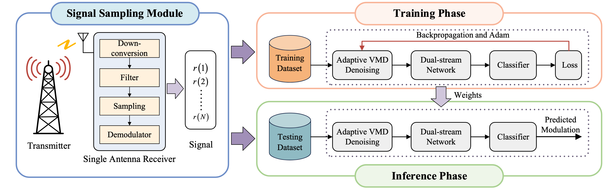
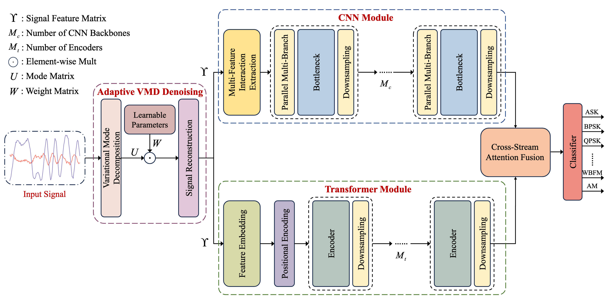

# AVDSDN

<div align="center">

**Synergistic Dual-stream Neural Network Based on Adaptive Variational Mode Decomposition Denoising for Automatic Modulation Classification**

[](https://www.python.org/)
[](https://pytorch.org/)
[](https://www.deepsig.ai/datasets/)
[](https://ieeexplore.ieee.org/document/11381447)
[](LICENSE)

Official PyTorch implementation of **AVDSDN** for robust automatic modulation classification (AMC) from raw I/Q samples.

</div>

## Overview

AVDSDN is designed for modulation recognition in noisy wireless channels. It turns variational mode decomposition (VMD) from a fixed preprocessing operation into a task-oriented denoising stage and combines it with a parallel CNN–Transformer architecture.

The model has three main components:

- **Adaptive VMD denoising (AVD):** learns point-wise weights for five VMD modes and reconstructs a signal optimized directly by the classification objective.
- **Synergistic dual-stream feature extraction:** a CNN stream captures robust local and spatial patterns, while a Transformer stream models long-range temporal dependencies with deformable attention.
- **Cross-stream attention fusion (CSAF):** adaptively combines the complementary features before classification.

<p align="center">
  
</p>

## Architecture

<p align="center">
  
</p>

## Highlights

- End-to-end, task-oriented adaptive denoising for non-stationary I/Q signals.
- Decoupled CNN and Transformer streams for complementary local–spatial and global–temporal representations.
- Pretrained checkpoint and a complete evaluation pipeline for RML2016.10a.
- Strong robustness in the low-SNR regime.

## Paper

The paper is available on [IEEE Xplore](https://ieeexplore.ieee.org/document/11381447):

> Y. Zheng, S. Huang, P. Zhang, Y. Zhang, and Z. Feng, "Synergistic Dual-Stream Neural Network Based on Adaptive Variational Mode Decomposition Denoising for Automatic Modulation Classification," *IEEE Transactions on Cognitive Communications and Networking*, vol. 12, pp. 6061–6075, 2026.

## Release scope

This release provides the model, VMD preprocessing pipeline, pretrained checkpoint, training code, and evaluation code for **RML2016.10a**. The current classifier is configured for its 11 modulation classes. Dataset-specific pipelines for RML22 and HisarMod2019.1, and the TensorRT INT8 deployment pipeline discussed in the paper, are not included.

## Repository structure

```text
AVDSDN/
├── data/
│   └── Dataprocess_VMD.py       # Offline VMD preprocessing and data split
├── doc/                         # README figures (tracked by Git)
├── model/
│   ├── AVDSDN.py                # Complete network and classification head
│   ├── Signal_Augment/          # Adaptive VMD mode weighting
│   ├── Conv_Stage/              # CNN stream
│   ├── Transformer_Stage/       # Deformable-attention Transformer stream
│   └── Feature_Fusion/          # Cross-stream attention fusion
├── weights/rml16a/
│   └── weights_rml16.pth        # Pretrained RML2016.10a checkpoint
├── main.py                      # Training and evaluation entry point
├── train.py                     # Training loop and checkpoint selection
├── predict.py                   # Evaluation, metrics, and visualization
├── tools.py                     # Normalization and confusion-matrix utilities
└── requirements.txt
```

## Installation

Clone the repository and create an isolated environment:

```bash
git clone https://github.com/ZhengYurui326/AVDSDN.git
cd AVDSDN

conda create -n avdsdn python=3.10 -y
conda activate avdsdn
pip install -r requirements.txt
```

A CUDA-capable GPU is recommended. If you need a specific CUDA build, install the matching PyTorch package from the [official installation guide](https://pytorch.org/get-started/locally/) before installing the remaining dependencies.

## Usage

Run all commands below from the repository root. The complete workflow is: download RML2016.10a, generate its five-mode VMD representation once, and then run either evaluation or training through `main.py`.

### 1. Download RML2016.10a

Download `RML2016.10a_dict.pkl` from the [DeepSig dataset page](https://www.deepsig.ai/datasets/). The dataset contains 220,000 examples from 11 modulation classes, with SNR values from -20 dB to 18 dB and 128 I/Q samples per example.

### 2. Generate the VMD representation

VMD is performed offline because decomposing the complete dataset on CPU is computationally expensive. From the repository root, run:

```bash
mkdir -p dataset
python -c "from data.Dataprocess_VMD import process_with_vmd; process_with_vmd('/path/to/RML2016.10a_dict.pkl', 'dataset/RML2016.10a_vmd_float32.pkl')"
```

The preprocessing configuration used by this release is:

| Parameter | Value |
|---|---:|
| Number of modes (`K`) | 5 |
| VMD bandwidth constraint (`alpha`) | 10 |
| Noise tolerance (`tau`) | 0 |
| Initialization | Uniformly distributed center frequencies |
| Convergence tolerance | `1e-7` |

The generated file is intentionally excluded from Git because of its size.

### 3. Evaluate the pretrained model

The repository includes `weights/rml16a/weights_rml16.pth`. The default settings in `main.py` are already configured to evaluate this checkpoint:

```python
train_enabled = False
eval_enabled = True
eval_weight_filepath = 'weights/rml16a/weights_rml16.pth'
```

Start evaluation with:

```bash
python main.py --data dataset/RML2016.10a_vmd_float32.pkl
```

The script automatically uses `cuda:0` when CUDA is available and otherwise falls back to CPU. It first creates the same deterministic 60/20/20 split used by the training pipeline, applies full-sample L2 normalization, loads the checkpoint, and evaluates the test split.

Evaluation produces:

- overall accuracy and mean F1 score;
- accuracy for every SNR level;
- per-modulation accuracy;
- overall and per-SNR confusion matrices;
- CSV metric files under `acc/<timestamp>/`;
- figures under `figure/<timestamp>/`.

### 4. Train from scratch

Set the run switches near the top of `main.py` as follows:

```python
train_enabled = True
eval_enabled = False
```

Keeping evaluation disabled during this run avoids evaluating the bundled checkpoint immediately after training. Start training with:

Then run the same entry point:

```bash
python main.py --data dataset/RML2016.10a_vmd_float32.pkl
```

The best checkpoint is selected by validation loss and saved to:

```text
weights/rml16a/<timestamp>/weights_rml16.pth
```

The validation history is saved to:

```text
training_loss/<timestamp>/training_loss.csv
```

### 5. Evaluate a newly trained checkpoint

After training, update these values in `main.py`:

```python
train_enabled = False
eval_enabled = True
eval_weight_filepath = 'weights/rml16a/<timestamp>/weights_rml16.pth'
```

Replace `<timestamp>` with the directory printed by the training run, then execute:

```bash
python main.py --data dataset/RML2016.10a_vmd_float32.pkl
```

### Run-mode reference

| Goal | `train_enabled` | `eval_enabled` | `eval_weight_filepath` |
|---|:---:|:---:|---|
| Evaluate the included checkpoint | `False` | `True` | `weights/rml16a/weights_rml16.pth` |
| Train a new model | `True` | `False` | Not used |
| Evaluate a new checkpoint | `False` | `True` | Path to the new `.pth` file |

## Reproducibility notes

- Inputs are L2-normalized over the complete sample before being passed to AVDSDN.
- Labels are stored as one-hot vectors by the data loader and converted to class indices during training and evaluation.
- The pretrained checkpoint is a plain PyTorch `state_dict` and is loaded with an exact architecture match.
- The current classifier is configured for the 11 classes in RML2016.10a.
- VMD preprocessing is deterministic for fixed input data and configuration; the train/validation/test split is controlled by the seed in `main.py`.

## Citation

If you find this project useful in your research, please cite the paper:

```bibtex
@article{zheng2026avdsdn,
  title   = {Synergistic Dual-Stream Neural Network Based on Adaptive Variational Mode Decomposition Denoising for Automatic Modulation Classification},
  author  = {Zheng, Yurui and Huang, Sai and Zhang, Pengcheng and Zhang, Yifan and Feng, Zhiyong},
  journal = {IEEE Transactions on Cognitive Communications and Networking},
  volume  = {12},
  pages   = {6061--6075},
  year    = {2026},
  doi     = {10.1109/TCCN.2026.3662331}
}
```

## Acknowledgements

We thank the authors of the following open-source projects for making their work available:

- [AMR-Benchmark](https://github.com/Richardzhangxx/AMR-Benchmark), which provides a valuable benchmark and reference implementations for automatic modulation recognition.
- [DAT: Vision Transformer with Deformable Attention](https://github.com/LeapLabTHU/DAT), which inspired the deformable-attention implementation used in this project.

## License

This project is released under the [MIT License](LICENSE).

## Contact

For questions about the code or paper, please open a GitHub issue or contact the authors at Beijing University of Posts and Telecommunications.
